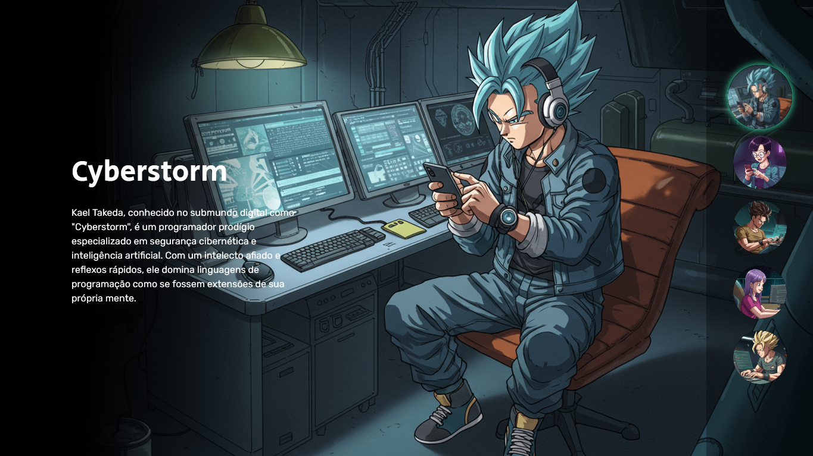
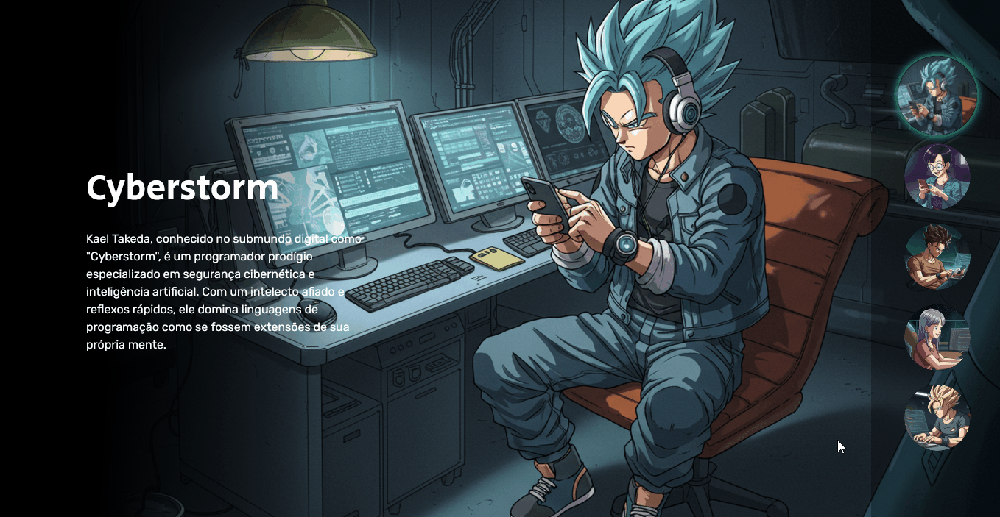

<h1 align="center">Projeto Dragon ball</h1>

  Projeto da Dev em dobro para saber do mundo da tecnologia e programação

  

 

## 🚀 Tecnologias

Esse projeto foi desenvolvido com as seguintes tecnologias:

- HTML CSS JS
- Git Github

## 💻 Projeto

O projeto serve para apresentar o mundo da programação. Se chama semana do dev, onde quem não entende e quem entende de programação participa para saber tudo do zero e/ou aprimorar os conhecimentos em programação.

## Como ficou o projeto online

  

## 📱 Mobile

  

  
<a href="https://do-zero-ao-programador-contratado-projeto-dragon-qvqqfzms2.vercel.app/" target="_blank">Clique para</a> acessar o link</a>
  

